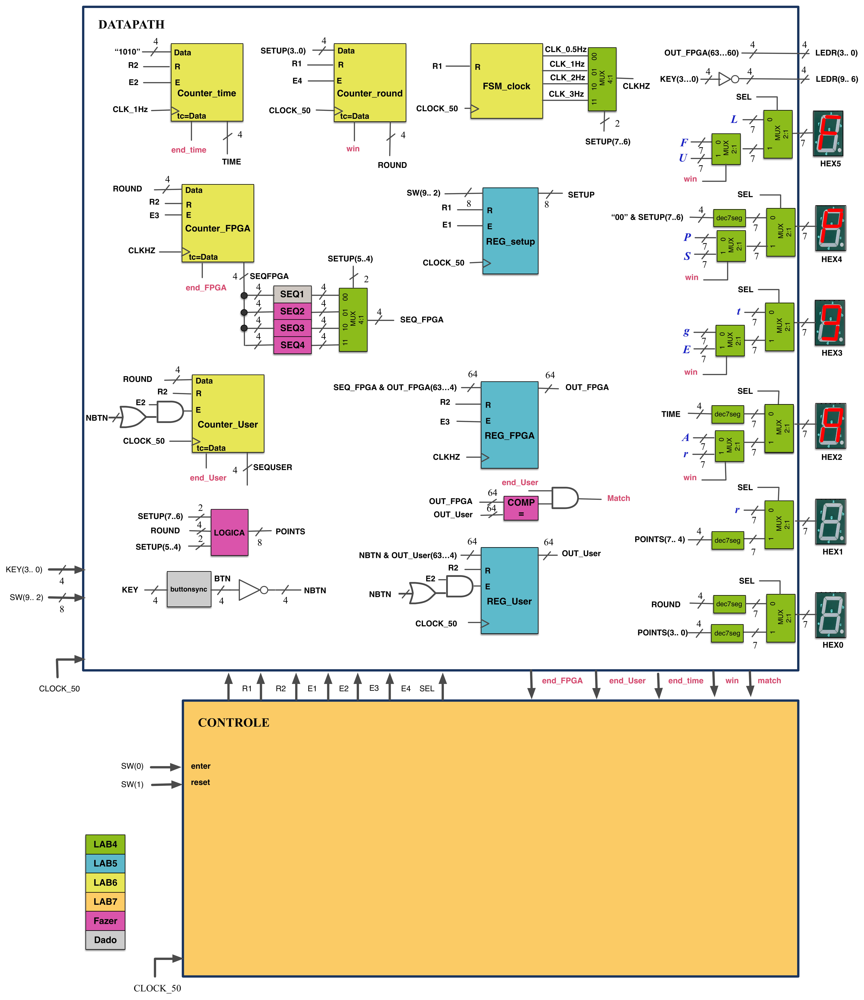

# Genius

This project is an implementation in VHDL of the game Genius (also known as Simon) for Altera's Cyclone IV FPGA. It was made using Quartus and there are two different project versions: one for Quartus Prime 19.1.0 and another for Quartus II 15.0.2. They are available in branches [#master](https://github.com/1allan/Genius/tree/master) and [#old](https://github.com/1allan/Genius/tree/old) respectively.

## Circuit Scheme
